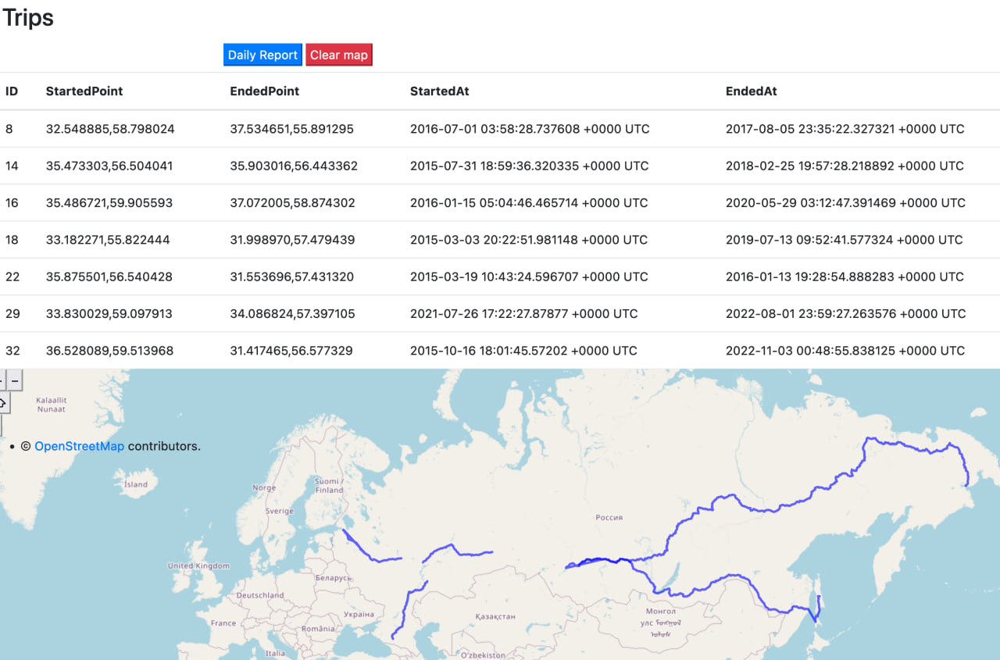
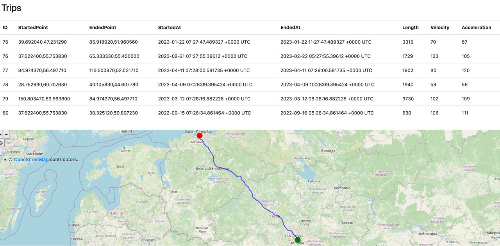
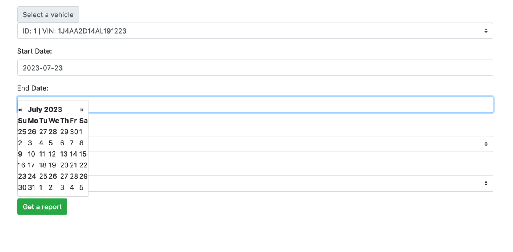
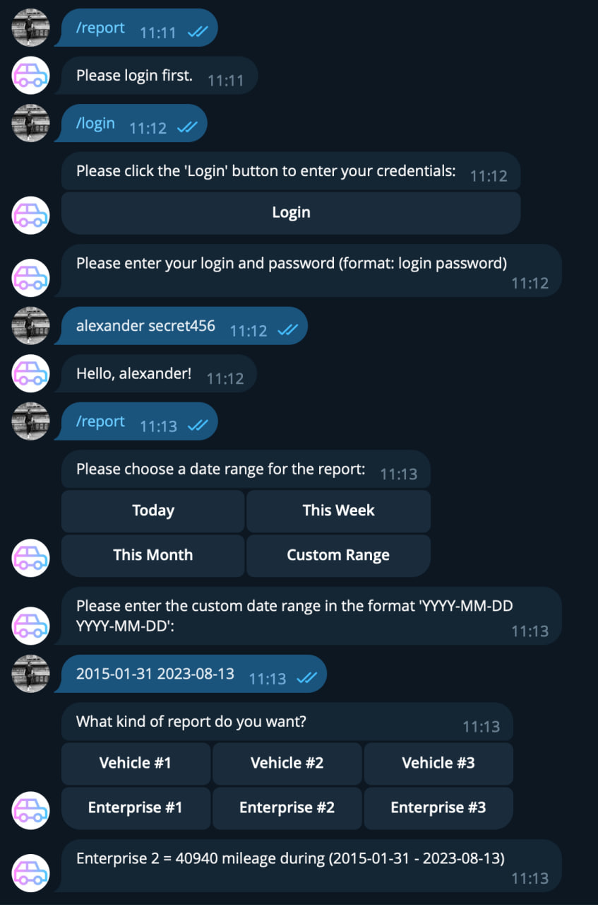

# Car Park (accounting and car tracking)

The Car Park is a web-based application that allows managers to efficiently manage various aspects of a car park, including enterprises, vehicles, tracks, trips, and generating reports.

## Features

### Vehicle's Trips Daily View

### Vehicle Trip View

### Configuring Trip Report

### Enterprise Management

- View a list of all enterprises registered in the car park.
- Add, update, or delete enterprises with relevant information.

### Vehicle Management

- Display a list of vehicles associated with the registered enterprises.
- Add, update, or delete vehicle details including model, price, year, mileage, color, and VIN.

### Track and Trip Management

- Track and log trips made by vehicles, recording important information such as start and end times, distance traveled, maximum velocity, and maximum acceleration.
- View detailed information about each trip and track.

### Reports Generation

- Generate reports summarizing the trips made by vehicles over specified periods.
- Generate reports on a daily, monthly, or yearly basis, detailing mileage and other relevant trip data.

### User Roles

- **Manager**: This is the main role, allowing access to all features of the application, including enterprise and vehicle management, track and trip management, and generating reports.

### Car Park Telegram Bot

## Getting Started

### Prerequisites

- Go (Golang) installed
- PostgreSQL database set up
- Dependencies: Gin, PostgreSQL driver

### Installation

1. Clone the repository (SSH):

~~~
git@github.com:novikov-ai/car-park.git
~~~

~~~
cd car-park
~~~

2. Configure your PostgreSQL database connection in `docker-compose.yml` (change ENV)

3. Build and run Docker:

~~~
docker-compose build
~~~

~~~
docker-compose up
~~~

4. Access the app in your web browser at `http://localhost:8080/login`.

## Usage

1. Log in as a manager.
2. Use the navigation menu to access different sections of the app: enterprises, vehicles, tracks, and reports.
3. Add, update, or delete enterprises and their associated vehicles.
4. Track trips and analyze track data.
5. Generate reports to monitor vehicle usage over different time periods.

## Contributing

Contributions to the Car Park are welcome! Feel free to open issues and submit pull requests for improvements or bug fixes.

## License

This project is licensed under the [MIT License](LICENSE).
